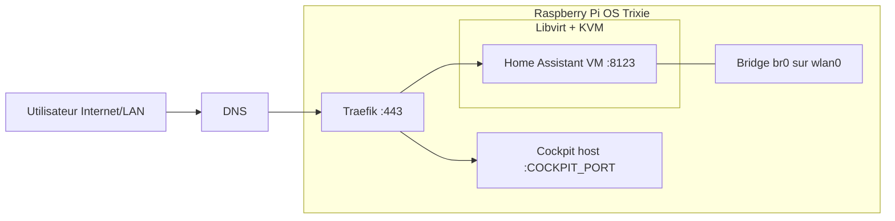
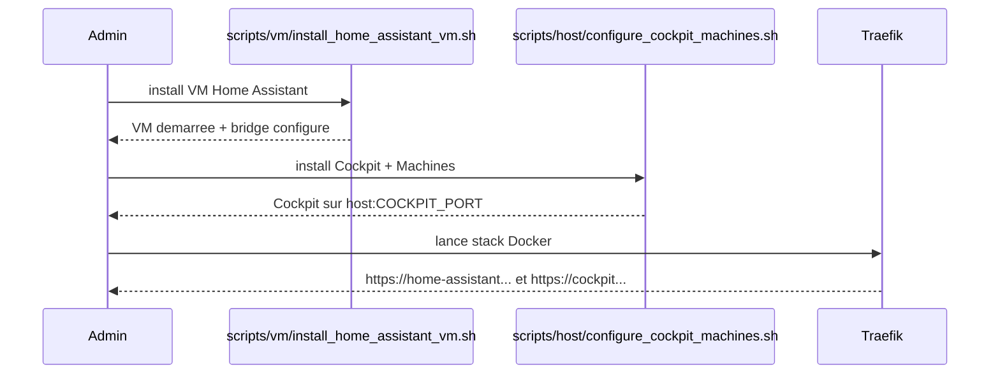

# Home Lab - Home Assistant VM (KVM) + Traefik + Cockpit

Ce projet permet de:
- installer KVM/libvirt sur Raspberry Pi OS Trixie (arm64),
- deployer la derniere version de Home Assistant OS en VM,
- gerer les VMs via Cockpit + cockpit-machines sur l'hote,
- exposer Home Assistant et Cockpit via Traefik.

## Vue d'ensemble (Mermaid)





## Prerequis

- OS: Raspberry Pi OS Trixie 64 bits
- Acces sudo/root
- DNS public qui pointe vers ton Traefik:
  - home-assistant.doudou.house
  - cockpit.doudou.house
- Ports 80/443 ouverts vers la machine Traefik

## Arborescence scripts

- scripts/vm/install_home_assistant_vm.sh: installation/rollback VM HA
- scripts/host/configure_cockpit_machines.sh: installation/rollback Cockpit host
- scripts/stack/up.sh: creation reseau Docker proxy + compose up

Wrappers de compatibilite a la racine:
- install_ha_vm_rpi_trixie.sh
- configure_cockpit_machines.sh
- run.sh

## Variables d'environnement

Copier puis editer:

```bash
cp .env.example .env
```

Variables principales:
- HA_VM_IP: IP de la VM Home Assistant vue par Traefik
- COCKPIT_FQDN: domaine public Cockpit
- COCKPIT_PORT: port de cockpit.socket sur l'hote (par defaut 9090)
- PHYS_IFACE: interface physique (par defaut wlan0)
- BRIDGE_NAME: nom du bridge Linux (par defaut br0)
- VM_NAME: nom de la VM libvirt
- TARGET_USER: utilisateur a ajouter aux groupes libvirt/kvm

## Installation complete

1. Installer Home Assistant VM:

```bash
sudo BRIDGE_CIDR=192.168.1.66/24 BRIDGE_GW=192.168.1.1 ./scripts/vm/install_home_assistant_vm.sh
```

2. Installer Cockpit + Machines sur l'hote:

```bash
sudo ./scripts/host/configure_cockpit_machines.sh
```

3. Lancer Traefik + stack Docker:

```bash
./scripts/stack/up.sh
```

## Reversibilite

Rollback VM Home Assistant:

```bash
sudo ./scripts/vm/install_home_assistant_vm.sh revert
```

Rollback Cockpit:

```bash
sudo ./scripts/host/configure_cockpit_machines.sh revert
```

Rollback avec purge paquets:

```bash
sudo PURGE_PACKAGES=1 ./scripts/vm/install_home_assistant_vm.sh revert
sudo PURGE_PACKAGES=1 ./scripts/host/configure_cockpit_machines.sh revert
```

## Traefik

Le fichier traefik/docker-compose.yml configure:
- Home Assistant: http://HA_VM_IP:8123
- Cockpit host: http://host.docker.internal:COCKPIT_PORT

Routage HTTPS:
- https://home-assistant.doudou.house
- https://cockpit.doudou.house (ou COCKPIT_FQDN)

## Verification

Verifier VM:

```bash
sudo virsh list --all
sudo virsh domifaddr home-assistant
```

Verifier Cockpit:

```bash
systemctl status cockpit.socket --no-pager
```

Verifier DNS:

```bash
dig +short home-assistant.doudou.house
dig +short cockpit.doudou.house
```

## Depannage

### Bridge sur Wi-Fi (wlan0)

Selon le chipset Wi-Fi et le point d'acces, le bridge L2 peut etre limite/non supporte.

### Cockpit derriere reverse proxy

Le script host ecrit /etc/cockpit/cockpit.conf avec:
- Origins = https://COCKPIT_FQDN
- ProtocolHeader = X-Forwarded-Proto

Il configure aussi cockpit.socket sur COCKPIT_PORT via un override systemd.

### Traefik vers host

Le service Traefik utilise host.docker.internal via host-gateway.
Si besoin, verifier la version Docker/Compose et le support host-gateway.
