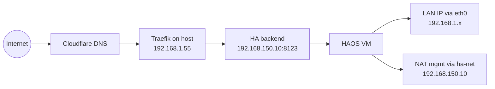

# home-lab

This repository contains self-hosted infrastructure automation and runtime configuration.

## Components

- `haos/`: Home Assistant OS on libvirt/KVM managed with OpenTofu/Terraform
- `traefik/`: reverse proxy and TLS termination
- `cockpit/`: cockpit-machines setup and diagnostics

## Global network topology

## Commands

Use `just` at repository root.

Cockpit:

- `just cockpit`
- `just cockpit::init-config`
- `just cockpit::install`
- `just cockpit::revert`
- `just cockpit::status`
- `just cockpit::check`
- `just cockpit::doctor`
- `just cockpit::logs`
- `just cockpit::url`

HAOS:

- `just haos`
- `just haos::init`
- `just haos::plan`
- `just haos::apply`
- `just haos::destroy`
- `just haos::output`
