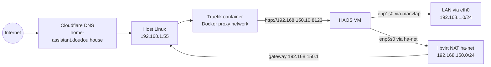

# HAOS KVM with OpenTofu/Terraform

This folder contains declarative infrastructure for Home Assistant OS on libvirt/KVM.

## Structure

- `versions.tf`: OpenTofu/Terraform and provider requirements
- `backend.tf`: local backend (state in `../state/`)
- `provider.tf`: libvirt provider
- `data.tf`: host arch and HAOS release lookups
- `locals.tf`: computed values (image URL, paths, XSLT)
- `network.tf`: optional NAT network + DHCP reservation (nat mode)
- `storage.tf`: image download, volume creation, disk resize
- `vm.tf`: VM definition
- `variables.tf`: input variables
- `outputs.tf`: useful outputs
- `../config/terraform.tfvars.example`: example variables file
- `../config/templates/`: XSLT templates
- `../state/`: local OpenTofu state

## Networking modes

- `network_mode = "host-bridge"`: VM NIC is attached to host interface using macvtap (default `host_bridge_interface = "eth0"`). VM gets an IP from your LAN DHCP.
- `network_mode = "nat"`: VM uses only the libvirt NAT network with DHCP reservation (`vm_ip`).

### Recommended with Traefik on same host

When Traefik runs on the same host as libvirt, macvtap host-bridge mode can prevent host/container to VM LAN access.
Keep `network_mode = "host-bridge"` for LAN presence and enable a second NAT management NIC:

- `enable_management_nat_interface = true`
- `vm_ip = "192.168.150.10"` (or your chosen NAT IP)

Then point Traefik backend to that NAT management IP.

## Network topology

## Effective addresses

- HAOS LAN IP (real network): DHCP on `eth0` (currently `192.168.1.56`)
- HAOS management IP (for same-host reverse proxy): `192.168.150.10`
- Traefik upstream for Home Assistant: `http://192.168.150.10:8123`

## Common commands

From `haos/`:

- `just init`
- `just plan`
- `just apply`
- `just output`
